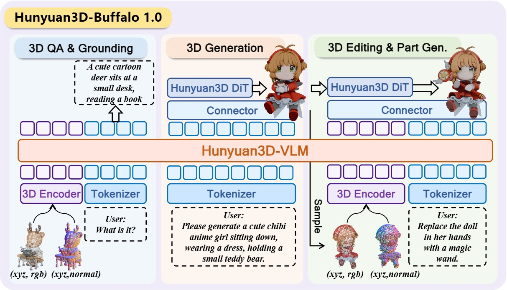
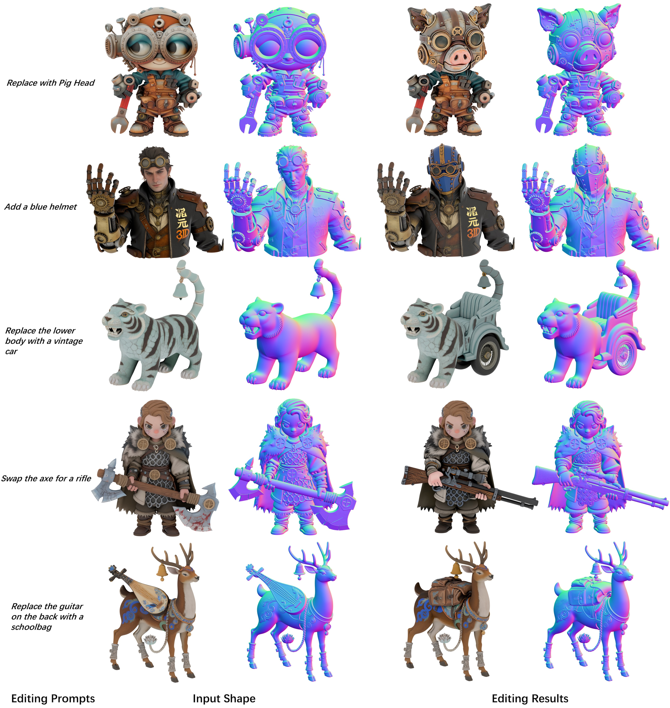

<p align="center">
  <h3 align="center"><strong>Hunyuan3D-Buffalo 1.0：A Unified Multimodal Model for Scalable 3D Generation, Understanding, and Editing</strong></h3>

<p align="center">
  <a href="https://arxiv.org/abs/2608.02711" target="_blank">
    
  </a>
  <a href="https://tencent-hunyuan.github.io/Hunyuan3D-Buffalo1.0/" target="_blank">
    
  </a>
  <a href="https://huggingface.co/papers/2608.02711" target="_blank">
    
  </a>
</p>

<p align="center">
  <video src="assets/intro.mp4" width="95%" muted loop autoplay controls></video>
</p>

## 📰 News
- 2026.08.05: 🔥🔥[Paper](https://arxiv.org/abs/2608.02711) and [project page](https://tencent-hunyuan.github.io/Hunyuan3D-Buffalo1.0/) are released.

## 📖 Method

<p align="center">
  
</p>

## 🏆 Result

<p align="center">
  
</p>

## 📝 Citation

```bib
@article{ye2026hunyuan3d,
  title={Hunyuan3D-Buffalo 1.0: A Unified Multimodal Model for Scalable 3D Generation, Understanding, and Editing},
  author={Ye, Junliang and Liu, Kenkun and Wang, Guocun and Li, Yang and Qu, Yansong and Wang, Chunshi and Xu, Jingwei and Yang, Yunhan and Zhao, Zibo and Xu, Jiachen and others},
  journal={arXiv preprint arXiv:2608.02711},
  year={2026}
}
```